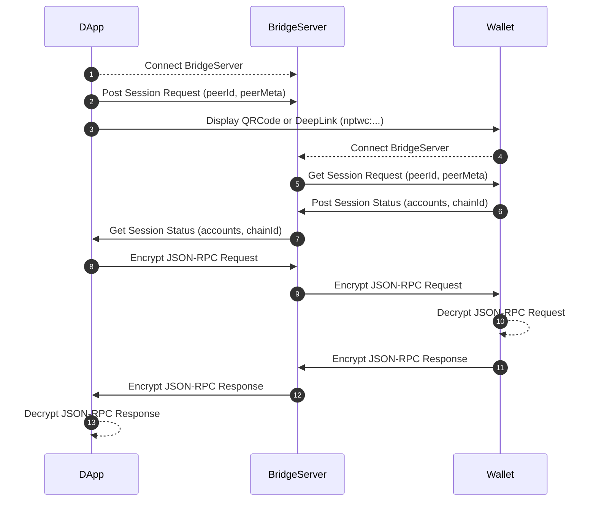

# Neopin Connect for [Android](https://github.com/Neopin/NeopinConnect-AOS), [iOS](https://github.com/Neopin/NeopinConnect-iOS) and [Web](https://neopin.io)

NEOPIN Connect is a service to connect DApps and NEOPIN Wallet more easily and safely, and is implemented based on the Wallet Connect used in Ethereum.

NEOPIN Connect supports remote connections between App-to-App or Web-to-App using a Bridge server to relay payloads. These payloads are symmetrically encrypted and delivered securely using a shared key between the two peers. The connection between App-to-App or Web-to-App is initiated by a DApp running a deep link that contains a QR code or a standard URI and is established when the NEOPIN Wallet approves the connection request.

Currently, only Klaytn coins/tokens are supported, and it will be expanded to various chains such as Ethereum and BSC in the future.




# Documentation
To get started with [NeopinConnect](https://docs.neopin.io/enjoy-with-neopin/neopin-connect), please refer to the NeopinConnect documentation. This describes key concepts on NeopinConnect, from what they are for, their structure and common use cases.

# Requirements
The minimum requirements for using the Android version of NEOPIN Connect are as follows:
- Android SDK 26 or higher (minSdk 26)

# Dependencies
- [WalletConnect (1.0)](https://docs.walletconnect.com/)
- [ZXing Android Embedded](https://github.com/journeyapps/zxing-android-embedded)
- [Caver Java](https://github.com/klaytn/caver-java)

# Installation
Android SDK can be installed using Gradle.

- Root Gradle Repositories
```groovy
repositories {
    ...
    maven { url 'https://jitpack.io' }
}
```

- App Gradle Dependency
```groovy
dependencies {
    ...
    implementation 'com.github.Neopin:NeopinConnect-AOS:1.0.0'
}

```

# License
NeopinConnect is available under the MIT license. See the LICENSE file for more info.

# Reference
- [WalletConnect (1.0)](https://docs.walletconnect.com/)
- [TrustWallet WalletConnect SDK](https://github.com/trustwallet/wallet-connect-kotlin)
